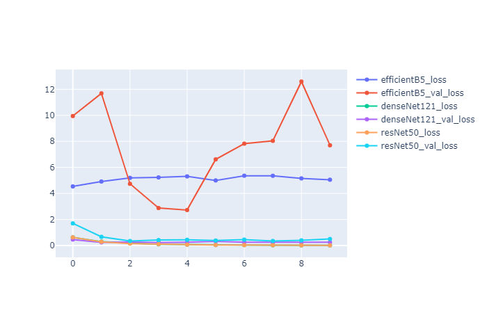

# 对比ResNet和denseNet、efficientNet对5种花分类效果
- 实现框架 keras
## 效果对比
在相同的图片增强以及超参，10epoch，三种模型的准确率和损失表现如下：
- resNet50与denseNet121，准确率差别不大，后者表现更稳定，收敛更快；两者的表现均比efficientNetB5要好。
### 准确率

### 损失值

所有代码 https://github.com/u19900101/keras-learning